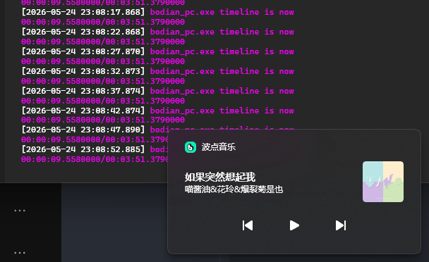

# 波点音乐 SMTC Bridge

为 [波点音乐](https://bodian.kuwo.cn/) Windows 客户端实现 SMTC（System Media Transport Controls）集成。

## 原理

可查看：[波点音乐 SMTC Bridge 实现原理](./docs/implementation.md)

## 效果图



## 使用方式

### 直接获取已编译的dll

你可以在（待补充）获取已编译的dll，直接复制到安装目录替换即可（记得备份原文件）

### 自行编译

#### 前置依赖

- Visual Studio（包含 C++ 桌面开发工作负载）
- CMake 3.25+
- Python 3.x

### 操作步骤

clone该项目，在根目录执行：

```powershell
.\scripts\Build.ps1
```

首次运行时自动检测波点安装目录，复制原始 `libmpv-2.dll` 后构建。也可手动将原 DLL 放入 `scripts\` 目录跳过检测。

构建完成后，交付目录 `dist\` 包含：

- `libmpv-2.dll` — 代理 DLL
- `libmpv_real.dll` — 原始 DLL（已重命名）

备份波点安装目录的原 `libmpv-2.dll`，将 `dist\*` （即该文件夹下所有的dll）全部复制到安装目录替换即可。

## 回退

用备份的原始 `libmpv-2.dll` 恢复即可（`libmpv_real.dll`可选保留）。

## ❤️

代码完全由AI生成，如有问题或建议欢迎issue和pr

## 参考资料

- [SMTC 手动控制](https://learn.microsoft.com/windows/apps/develop/media-playback/system-media-transport-controls)
- [mpv 客户端 API](https://mpv.io/manual/master/#client-api)

## 许可证

Apache License 2.0
